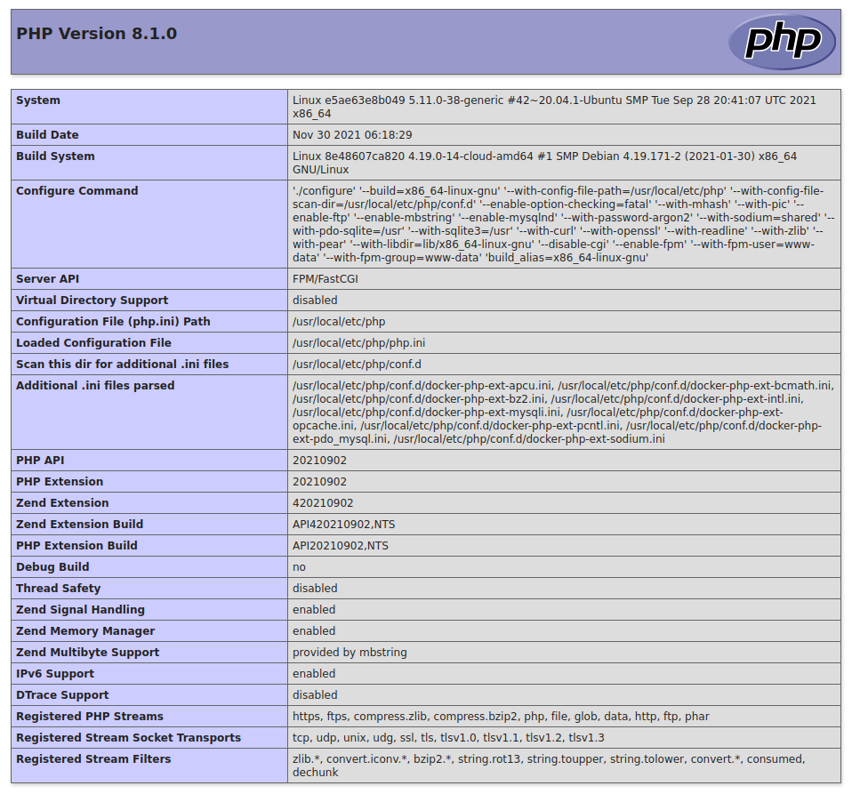

# template-php

1. [About project](#about-project)
1. [Set up project](#set-up-project)
   * [Installation](#installation)
   * [Configure environment variables](#configure-environment-variables)
   * [Run project](#run-project)
1. [Run Tests](#run-tests)
   * [PHP Unit](#php-unit)
1. [Code Quality Checker Tools](#code-quality-checker-tools)
   * [PHP_CodeSniffer](#php_codesniffer)
   * [PHPStan](#phpstan)
   * [PHP Mess Detector](#php-mess-detector)
   * [PHP Magic Number Detector](#php-magic-number-detector)
   * [PHP Copy Paste Detector](#php-copy-paste-detector)
   * [Churn-php](#churn-php)
   * [PhpDeprecationDetector](#PhpDeprecationDetector)
1. [Code Analysis Tools](#code-analysis-tools)
   * [Deptrac](#deptrac)

## About project
- [x] PHP 8
- [x] Installed Code Quality Checker Tools: PHP_CodeSniffer, PHPStan, PHP Mess Detector, PHP Magic Number Detector, PHP Copy Paste Detector, Churn-php, PhpDeprecationDetector
- [x] Installed Code Analysis Tools: Deptrac

## Set up project

If not already done, [install Docker Compose](https://docs.docker.com/compose/install/) before continue with installation

### Installation

Clone repository:

    git clone https://github.com/burus86/template-php.git

Build and up docker containers:

    cd template-php
    docker-compose -f docker/docker-compose.yml up -d --build

Install composer dependencies:

    docker exec -it template-php composer install

### Configure environment variables

Copy filename `.env.dist` as `.env` and edit parameters for test environment.

Copy filename `.env.dist` as `.env.test` and edit parameters for test environment.

### Run project

Finally, you can see the web under [http://localhost:8080/](http://localhost:8080/) in your favorite web browser.

## Run Tests

### [PHP Unit](https://github.com/sebastianbergmann/phpunit)

    docker exec -it template-php vendor/bin/phpunit

## Code Quality Checker Tools

### [PHP_CodeSniffer](https://github.com/squizlabs/php_codesniffer)

    docker exec -it template-php vendor/bin/phpcs src/ tests/
    docker exec -it template-php vendor/bin/phpcbf src/ tests/

### [PHPStan](https://github.com/phpstan/phpstan)

    docker exec -it template-php vendor/bin/phpstan analyse -c phpstan.neon

### [PHP Mess Detector](https://github.com/phpmd/phpmd)

    docker exec -it template-php vendor/bin/phpmd src/ text phpmd.xml

### [PHP Magic Number Detector](https://github.com/povils/phpmnd)

    docker exec -it template-php vendor/bin/phpmnd src tests --progress --extensions=all

### [PHP Copy Paste Detector](https://github.com/sebastianbergmann/phpcpd)

    docker exec -it template-php vendor/bin/phpcpd ./ --exclude=var --exclude=vendor --fuzzy --min-lines=5

### [Churn-php](https://github.com/bmitch/churn-php)

`churn-php` is a package that helps you identify php files in your project that could be good candidates for refactoring.

    docker exec -it template-php vendor/bin/churn run --configuration=churn.yml

### [PhpDeprecationDetector](https://github.com/wapmorgan/PhpDeprecationDetector)

    docker exec -it template-php php bin/phpdd src/ tests/

## Code Analysis Tools

### [Deptrac](https://github.com/qossmic/deptrac)

    docker exec -it template-php vendor/bin/deptrac analyse
